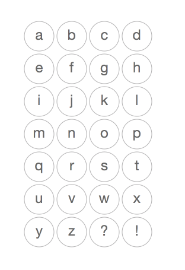
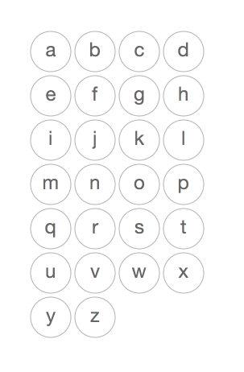

# 2D Grid

Two examples of how to draw a (linear) sequence in a 2D grid.

## example 1

[`loop_2D_example1.pv`](loop_2D_example1.pv)

- Use nested loops to loop over the two dimensions (`for x in ...` and `for y in ...` )
- Need special code to get the word from the list
- You'll run into a challenge when the number of words *is not matching*  the multiplication of `x * y`

## example 2

[`loop_2D_example2.pv`](loop_2D_example2.pv)

- Use a single loop to loop over the words (`for w in words`)
- Need special code to calculate the `x` and `y` for each word

