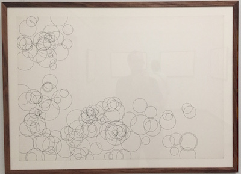
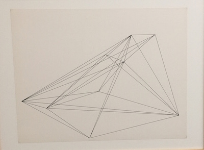
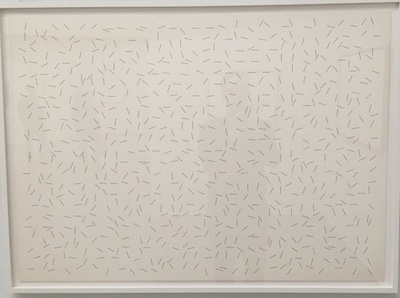
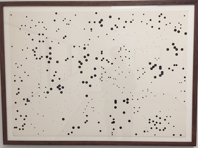

#####Department: Graphic Design

- Course: **Media Design**
- Year: 2015-2016, 2nd year
- Teacher: Dirk van Oosterbosch
- Semester: 1

###Assignment #1:
#Algorithmic Nature

##Learning Goals

Develop an understanding of algorithms and how to use them to create procedural drawings. Acquire an insight in the process of producing visuals through computer code. Being able to produce visually interesting works using procedural drawings. Collect a set of techniques that you will able to use in future works.

----

**a unified approach to grown structures**  
(by *Neri Oxman, Christoph Bader & Dominik Kolb*. from https://www.behance.net/gallery/21605971/Neri-Oxman-Wanderers)

----
##Description

Study the following 5 algorithms and create computer generated sketches and drawings using them. From each of these algorithms an example in code will be given. The assignment is to take this example and experiment with it further, creating unique and interesting drawings / sketches.

####These are the five algorithms

- fibonacci
- perlin noise
- recursion
- L-systems
- *flocking (if time permits)*

*(ordered from simple to advanced)*

####Limitations

To make the assignment a little more interesting and concrete, these are the limitation the drawings or sketches should adhere to:

- the canvas of the drawings are square (dimension should not matter if you use vectors)
- only use black and white and greyscales
- take a model from nature as inspiration
- the drawings must be procedural, meaning a computer renders them based on your rules
- you must code the drawings your self
- use python as programing language
- publish source code and results on gitHub

----

**Random drawings (toevalstekeningen)**  
(by *Herman de Vries*, 1971-1972, [KrollerMuller Museum](http://krollermuller.nl/herman-de-vries-toevalstekeningen))

----
##Planning

#####Week 1:
*September 3rd 2015*

- Introduction to the Media Design course.
- Introduction to the assignment.

**Homework:**

- Create an account on GitHub, let me and your class know your account handle and accept the invitation to the shared repository.
- Download and install the [software](Software.md)
- Create a journal, notebook or blog about your research.
 	1. Document your programming efforts, ideas and sketches
	2. Collect frustrations with digital tools
- Visit a botanic garden or zoo for inspiration.
- Watch Vi-Heart's video about Spongebob (see [literature](#literature))

#####Week 2:
*September 10th 2015*

- Fibonacci

#####Week 3:
*September 17th 2015*

- Perlin Noise

#####Week 4:
*September 24th 2015*

- Recursive functions

#####Week 5:
*October 1st 2015*

- L-systems

#####Week 6:
*October 8th 2015*

- Evaluation. (One-on-one evaluation)

##Evaluation

Criteria for judging the work:

- The **creative process**,
- the digital process and **workflow** of creating procedural drawings,
- **insight** in the algorithmic aspects of nature,
- acquired **coding skills** and
- the **expressive qualities** within the limitation of the assigment.

##Literature

#####Fibonacci
- [Vi Heart - SpongeBob's Pineapple (video)](https://www.youtube.com/watch?v=gBxeju8dMho)

#####L-systems
- [The Algorithmic Beauty of Plants](http://algorithmicbotany.org/papers/abop/abop.pdf) (Mathematic Scientific Paper)

#####Nature + Code

- [**Hello World!**](http://hello-world.cc/?page_id=16) (Documentary 2013) ([Watch on Vimeo](https://vimeo.com/60735314))
- [**Nature of Code** - Vimeo Video channel by *Daniel Shiffman*](https://vimeo.com/channels/natureofcode)

#####Inspiration

- [**How algorithms shape our world** - *Kevin Slavin*](http://www.ted.com/talks/kevin_slavin_how_algorithms_shape_our_world?language=en) (TED Talk, 2011)
- [Blurry-paths Tumbler Blog](http://www.blurrypaths.com/tagged/coding)

*Liturature to be expanded ...* 

<!--#####Recursive Functions
- [two simple examples in Python and Processing](https://github.com/ArtezGDA/recursiveExamples)
-->