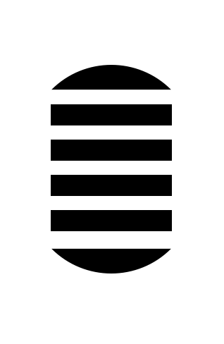
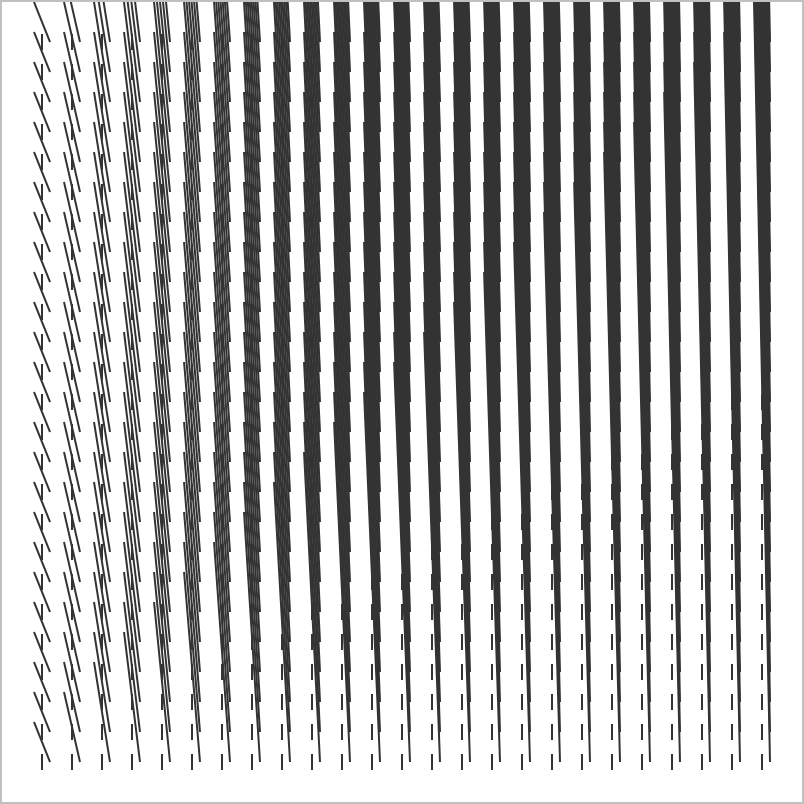
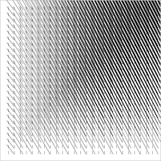
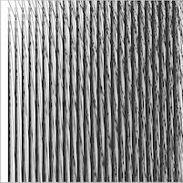
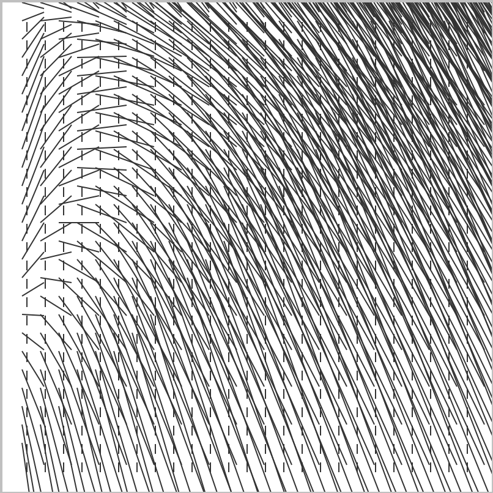
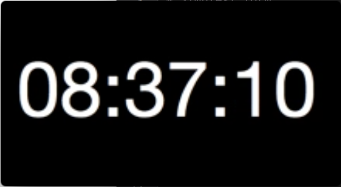
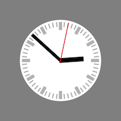

# Coding homework about `for` loops

- create the following sequences

#### sequence 1
```
0
1
2
3
4
5
6
7
```

#### sequence 2
```
1
4
9
16
25
```

#### sequence 3
```
10
9
8
7
6
5
4
3
2
1
liftoff!
```

### Modify the hamburger

- create the following image using a for loop



### Create a grid

- grid of 25 by 25 crosses, with 15 pixels in between.
- experiment with the grid and create images, similar to these:

  
  
  
  

### Clock animation

- create a clock animation



See the [animation](animation.pv) example for a template how to create an animation in plotdevice

### Three tricks:

- if trying, try with subset of range (e.g. `range(5, 25)`, instead `range(100)` )
- set `fontsize()` and `fill()` color, each time after the `clear(all)`
- with [text formatting (see **old style** formatting)](https://pyformat.info), use `%02d` to create the string *"03"* from the number *3*. 

And study the [plotdevice tutorial](http://plotdevice.io/tut/Getting_Started) and [reference](http://plotdevice.io/manual#ref) for help on the plotdevice functions.

### For extra points: 

- create a animation of a analog clock, like this one:


