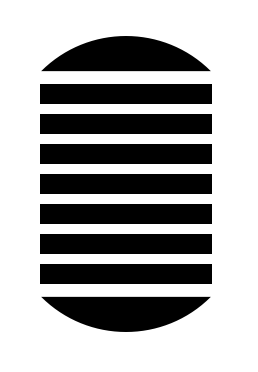

# `for` loops

## The simplest form

The simplest form of a `for` loop is the following:

```python
for i in range(5):
	print i
```

```
0
1
2
3
4
```

Essentially, a `for` loop *loops through all the elements in a 'sequence'*, where you can do something with each of these elements inside the `for` block.

#### Use cases

So you could use a for loop to, e.g.:

- loop through all the pixels in an image (to determine its color, or to modify it)
- loop through all the people in an attendence list
- loop through all the records in a database
- loop through all cards in a deck
- ... etc.

And when there is no collection, list, array or sequence to loop through, we create one ourselves, with `range`.

## What is this `range`

`range` will create a list of (integer) numbers in a sequence.

Try these examples:

```python
print range(10)
print range(5, 15)
print range(0, 10, 2)
print range(20, 0, -2)
```

## Loop through other type of lists

We can also loop through other kinds of lists, e.g. a list of strings:

```python
colors = ["white", "yellow", "orange", "red", "pink", "purple", "blue", "green", "brown", "black"]

for c in colors:
	print c
```

Or perform some action on these strings, while we are looping through them

```python
for c in colors:
	print c.upper()
```

And, we could even do more with these colors ...  The following code must be executed in a Plotdevice (`.pv`) file:

```python
size(400, 400)
background(0.5)

colors = ["white", "yellow", "orange", "red", "pink", "purple", "blue", "green", "brown", "black"]

y = 40
for c in colors:
    fill(color(c))
    text(c.upper(), 20, y)
    y += 20
```

## Exercise: simplify redundant code

A very common task in programming is to **make your code shorter and simpler**. It is important to maintain simple code because:

- less code is less prone to errors
- simple code is easier to read and understand
- fewer variables means its easier to maintain and modify
- simple code means stable and reusable code

In code of beginning programmers, you often see a lot of repetition –because it is way too easy to cmd+c / cmd+v–. But **in code repetition is bad**.

As an example, here is some plotdevice code that draws a super big, 7 layer, "hamburger".



```python
size(512, 512)
background(1)

fill(0)

# top
arc(120, 120, 60, range = (45, 135), ccw = True)

# middle part
rect(77, 84, 86, 10)
rect(77, 99, 86, 10)
rect(77, 114, 86, 10)
rect(77, 129, 86, 10)
rect(77, 144, 86, 10)
rect(77, 159, 86, 10)
rect(77, 174, 86, 10)

# bottom
arc(120, 148, 60, range = (45, 135))
```

#### As an exercice, simpily this code and use a for loop for the middle part

## Nested `for` loops

`for` loops can also be *nested*. That means that there is a `for` loop, *inside* another `for` loop. (or inside another, and another ...). The idea of the nested `for` loop is that you repeat the whole process of running the loop.

Nested `for` loops are very common. Today, I'll show you two examples:

- create a 2 dimensional grid
- filter a list of things

### Create a 2 dimensional grid

The following code creates a 2 dimensional grid in plotdevice:

```python
size(400, 400)
background(1)

stroke(0.2)

# vertical
for y in range(40, 380, 20):
    for x in range(40, 380, 20):
        # cross hairs
        s = 4 # half length Size
        line(x - s, y, x + s, y)
        line(x, y - s, x, y + s)
```

### filter a list of things

The following example filters a list of things (*foods*), by checking another list of filters (*dont_likes*):

```python
dont_likes = ["lettuce", "cabbage", "sesami", "sprouts"]
foods = ["tomatoes", "bananas", "cabbage", "lettuce", "spinach", "fries", "apples"]

# kids menu
for food in foods:
	include = True
	for bleh in dont_likes:
		if food == bleh:
			include = False
	if include:
		print food
```

## While loops

See the next lesson: [Lesson 2: Variables](../Lesson_02_Variables/README.md) for more about the while loop.

## Animations in plotdevice

The following code is boilerplate template for creating an animation with plotdevice:

```python
size(220, 120)
background(1)

# export a 100-frame movie
movie = export('anim.mov', fps=50, bitrate=1.8)
for i in xrange(100):
    clear(all)  # erase the previous frame from the canvas
    # Do some drawing:
    text("counting to ... " + str(i), 10, 60)
    movie.add() # add the canvas to the movie
movie.finish()  # wait for i/o to complete
```

Open this code in Plotdevice and run it. This will create a movie called *anim.mov* in the same directory as your plotdevice file.

## Difference between Terminal, python file and Plotdevice

In class I showed the difference of working in:

- the Terminal with **iTerm** and the `python` or the `ipython` command
- the **Atom** app to open and edit python `.py` files. For usefullness install the following extra packages in Atom:
	- autocomplete-python
	- python-tools
	- script
- the **Plotdevice** app to open and edit plotdevice `.pv` files and use Plotdevice's special drawing functions.

## Links to plotdevice reference and tutorial

- [Plotdevice Reference](http://plotdevice.io/manual#ref)
- [Plotdevice Tutorial](http://plotdevice.io/tut/Getting_Started)

### `rotate` ... and `with rotate:` ... and `reset()`

When you want to create the analogue clock for the **extra points** homework, specifically study these plotdevice functions:

- [`rotate`](http://plotdevice.io/ref/Transform#rotate())
- `with rotate:`
- [`reset`](http://plotdevice.io/ref/Transform#reset())