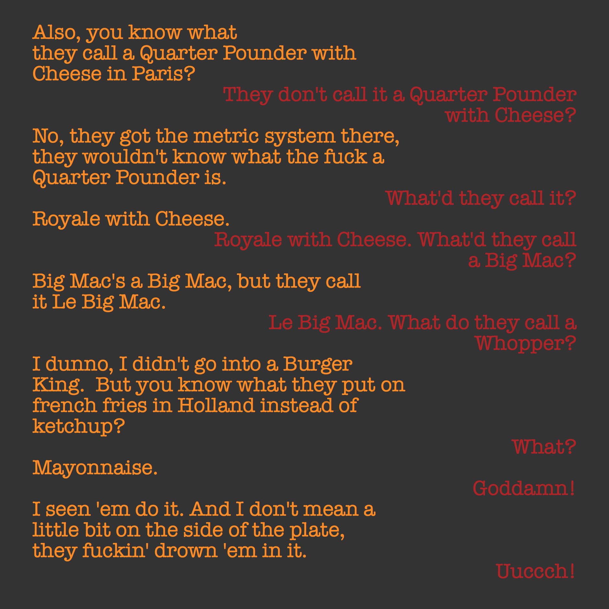

# Coding homework with conditions and the `if` statement

#### Create a design like this one:

See [pulp_fiction.py](pulp_fiction.py) for the text.

This python file also contains help about two necessary functions:

- `startswith()`
- `[]` (_substrings in python_)

#### Take a look from your window tomorrow; take note of the band of colors you see in the sky; mimic that in a grid of lines like so:

#### Create a **Flow Chart** of a Vote Match (_stemwijzer_) for the upcoming presidential ellections in the United States of America

See the [Vote Match example in Plotdevice](vote_match_example.pv) as inspiration.

(Note: it's not important to create functioning code, just the Flow Chart for it ... of course, if you're feeling challenged, you're free to modify the example to match your flow chart, but that is not the assignment, yet.)