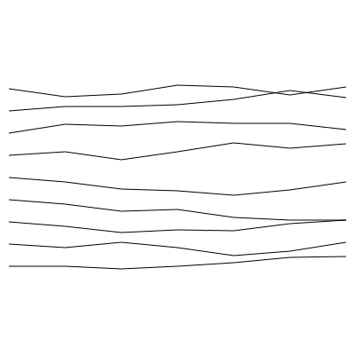

# Functions

Functions are blocks of code that can be called by other pieces of code.

Think of a **function** as a **sub-part** of a recipe. Say you're making lasangne, part of that is béchamel sauce. But the recipe for the Béchamel is not convenient to be included in the recipe for lasagne, because you'll need it in other recipes too. Therefor you would create a function for the recipe of Béchamel, so you can just write in the lasange recipe: "Make a Béchamel sauce".

This lesson is about functions, and how to use them in your progamming.

### Random lines

During this lesson we will create the following image:

