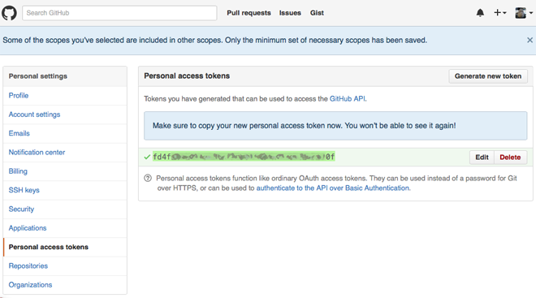

# Lesson 05: Scraping

### Introduction

Scraping the automatic collection (and possibly organization) of big quantities of data, often from online sources.

Examples of tasks you might wish to execute using scraping:

- Find all occurances of the word 'horror' in the collected works of Edgar Allan Poe.
- Find all links and references in a set of markdown files.
- Find the box office revenues of all Disney movies.
- Collect all commit messages from a repository on github.

### Process

The process of scraping can be compared to the process of mine a rare ore:

*Acquire* -> *Parse* -> *Filter* -> *Organize*

1. **Acquire** - Automatic collection of huge quantites of data
2. **Parse** - Interpret the data as content. (e.g. parse the html into useful values)
3. **Filter** - Filter the information and only keep what is looked for
4. **Organize** - Collect these bits of information into a coherent set

### Examples

- [json reading and writing](https://github.com/ArtezGDA/Course-Material/tree/master/Basics/json)
- [find links in markdown files](https://github.com/ArtezGDA/Course-Material/tree/master/Basics/filter-files)
- [scrape Disney's box office from Wikipedia](https://github.com/ArtezGDA/python-web-scraper)
- use an API ... (read on)

## GitHub API

An API (Application Programming Interface), is a layer of access (and interactivity) which can be used by developers to gather data. The data is often similar to the data you can gather from just visiting the services' website or by using the app. The difference is that an *API* allows this process to be automated, so computers can talk to computers, instead of humans talking to computers or vice versa.

### Documentation

A quick online search for `Github API` brings you to the official API page:  
[GitHub API v3 | GitHub Developer Guide](https://developer.github.com/v3/)

This API is the most basic form of their API, which works with simple HTTP GET requests, and parsing the response. The benefit of such a HTTP API, is that is so simple that every type of device or language can use this. However, simple in this case also means its more work, and complicated to use it.

For our case, we want to look a bit further and go look for a Python API.

### Python API 

There are a few different Python libraries which can be used as python wrapper around the Github API, but the one with the most traction at the moment is [PyGithub](https://github.com/PyGithub/PyGithub)

As with more and more tools, its documentation is hosted elsewhere, at [readthedocs.org](http://pygithub.readthedocs.org/en/stable/)

### Installation

From this documentation, click on the **Introduction**, then **Download and install**. So we can use the familiar `easy_install`:

`sudo easy_install PyGithub`

### User + Password

The tutorial starts with the following. Importing the module and create a Github instance from a *user* and *password*:

```python
from github import Github

g = Github("user", "password")
```

Ofcourse you should replace the *user* and *password* with a valid username and password for Github. But there are two major security issues with just using your normal Github password:

1. You use your root password for everything on Github, so also editing, deletion and changing your profile. You do not want a simple scraping script to be able to do this. What if you make a mistake?
2. You surely **DO NOT** want to publish your passwords online. (Which is what you will be doing when you make your scraping script available on Github)

So we need to be safe and find a secure way around these threats.

#### Step 1: Create a special password for this usage.

1. Click to your avatar icon in the top right corner of a page on Github
2. Go to **Settings**
3. Select **Personal access tokens** from the left column
4. Click on **Generate new token**
5. Type in your password
6. Select a few necessary scopes (repo, public repo, user:email, repo:status) and give this token a name e.g. "Github from python"
7. Click **Generate token**
8. Copy the resulted token and store it in a safe file



By selecting the scopes you made sure this password can only be used for a limited set of actions, you approved off. Further more, if you're done with it or if the password might have been compromised, you can just toss it away and create a new one.

#### Step 2. Make sure you do not commit the token.

Committing secret keys, tokens and passwords is really **the very last thing you want to do**. So let's make sure it doesn't happen. The best trick for this is to store the token in a seperate file, and make sure the file is never added to Github.

1. Create a new file called `secret_password.py`
2. In that file create a dictionary like the following:  
	```python
	github_account = {'user': "your_user_name", 'password': "the_token_1234abcdef9876543210"}
	``` 
3. Use this to get access to GitHub from your script. The example now is as follows:
	```python
	from github import Github
	from secret_password import github_account

	g = Github(github_account['user'], github_account['password'])
	```
4. To make sure the password file is not accidently added to Github, add the file to the *git ignores*. (The *git ignores* is a set of filenames or patterns of filesnames of files you want to have ignored from the git system, so they are not added or updated. **Warning**, these ignores can still be added if you really wish to do so, so keep making sure you don't add them later).
5. Create a file called `.gitignore` and add the following in it:
	```gitignore
	# ignore these files and patterns
	secret_password.py
	
	```
6. Type `git status` to verify that the password file won't be committed but the `.gitignore` will.

### Continue the tutorial

Print out a list of repositories you can commit to:

```python
for repo in g.get_user().get_repos():
	print repo.name
```

So what exactly happens here? And where is the documentation? Let's break these two lines up into smaller bits:

- You should recognize `for e in a_collection:` as a familiar *for loop*
- `g.get_user()`: a method `get_user()` on the Github instance `g` of above.
	- Let's find the documentation of this method. It's part of the [**Main class: Github** reference](http://pygithub.readthedocs.org/en/latest/github.html)
	- Jump to the section about the [`get_user()`](http://pygithub.readthedocs.org/en/latest/github.html#github.MainClass.Github.get_user) method
	- You see that it returns a `github.NamedUser.NamedUser` object. Open the documentation on [NamedUser](http://pygithub.readthedocs.org/en/latest/github_objects/NamedUser.html)
- `.get_repos()`: is a method called on this NamedUser object.
	- Read the documentation on the [`get_repos()`](http://pygithub.readthedocs.org/en/latest/github_objects/NamedUser.html#github.NamedUser.NamedUser.get_repos) method
	- You see the return type is a `github.PaginatedList.PaginatedList` of `github.Repository.Repository`s
	- The *Paginated List* means that it will not return these repositories all in once, but in smaller quanties (pages), so the network and other systems can manage giant lists more easily. Luckily for us, we can still just use *Paginated Lists* like in a for loop, like we do with *lists*.
- Inside the for loop the `repo` variable represent each repository in turn.
	- Open the documentation from the [`github.Repository.Repository`](http://pygithub.readthedocs.org/en/latest/github_objects/Repository.html) link from above.
	- Find the `name` property: [`name`](http://pygithub.readthedocs.org/en/latest/github_objects/Repository.html#github.Repository.Repository.name)
	- And see what other things can be found out about a repository.
	
### Get a list of all commit (for a single repository)

That was the purpose of this excersise to begin with, wasn't it? A nice list of all commit messages from everybody.

To find out how we could figure out this ourselves, use the following route:

1. Get a single repository with [`g.get_repo()`](http://pygithub.readthedocs.org/en/latest/github.html#github.MainClass.Github.get_repo)
	- The documentation tells us that we need to give it its `full_name` or its `id`. We don't know its id, so we'll use the full_name.
	- If, in the example above, you `print repo.full_name`, you get the full names
	- Use those to get the repo: `repo = g.get_repo('ArtezGDA/Algorithmic-Nature')`
	- What if you would use a wrong name? (like the non-full `name`?)
		- Unfortunatelty, the error is not so clear. You *can* do `repo = g.get_repo('blah')` without complaints.
		- And `repo` will just be a github.Repository.Repository type. ...
		- But if you try to access specific properties (like its name): `repo.name` will 'throw' this
		- `UnknownObjectException: 404 { ... 'Not Found'}`
		- That just means it cannot find the repository with the given id or full_name, but that it was the repository which cannot be found, is for you to deduct yourself. :(
2. Use `ipython`'s tab auto-completion to see the possibilities of an object:
	- After you created a [github.Repository.Repository](http://pygithub.readthedocs.org/en/latest/github_objects/Repository.html) with `repo = g.get_repo('...')`,
	- type `repo.` and press the TAB key (do not yet press RETURN)
	- *iPython* will show all the 158 possibilities with a Repository.
	- type `get` and press TAB (it now reads `repo.get_`)
	- *iPython* will limit the possibilities to only those starting with `.get`
	- type `com` (it now reads `repo.get_com`) and press TAB
	- *iPython* will show the remaining 4 possibilities. There it is: **`.get_commits`**
3. Look up the documentation about [`get_commits()`](http://pygithub.readthedocs.org/en/latest/github_objects/Repository.html#github.Repository.Repository.get_commits)
	- You see that it returns a `github.PaginatedList.PaginatedList` of `github.Commit.Commit`s
	- Get one commit and investigate that one: `c = repo.get_commits()[0]`
		- the `c` will just be a quick variable name for *commit*
		- the `[0]`, the first element of the *PaginatedList* will be the most recent commit.
4. Investigate the `github.Commit.Commit`:
	- type `c.` and TAB to autocomplete
	- See it has some 21 things that you can do with it, but no *message*
	- Read the documentation on [`github.Commit.Commit`](http://pygithub.readthedocs.org/en/latest/github_objects/Commit.html#github.Commit.Commit)
	- Realize there are **two** types: [`github.Commit.Commit`](http://pygithub.readthedocs.org/en/latest/github_objects/Commit.html#github.Commit.Commit) and [`github.GitCommit.GitCommit`](http://pygithub.readthedocs.org/en/latest/github_objects/GitCommit.html#github.GitCommit.GitCommit). We want the latter!
	- And see that you can get the `github.GitCommit.GitCommit` from the `github.Commit.Commit`, using the [`.commit`](http://pygithub.readthedocs.org/en/latest/github_objects/Commit.html#github.Commit.Commit.commit) property.
5. Get that `github.GitCommit.GitCommit`:
	- type `gc = c.commit`
	- Investigate that gc object. See we have:
		- `.author`
		- `.last_modified` (which is probably a date)
		- `.message`
		- `.parent` (if we which to draw a (tree) graph from these commits)
6. The *Message* and *last_modified* are straight forward, but what about the author?
	- Investigate the [`github.GitAuthor.GitAuthor`](http://pygithub.readthedocs.org/en/latest/github_objects/GitAuthor.html#github.GitAuthor.GitAuthor) object
	- Is has two useful properties:
		- `.name`
		- `.email`
	- Also realize that there is the `.author` property of the `github.Commit.Commit` object which is a [`github.NamedUser.NamedUser`](http://pygithub.readthedocs.org/en/latest/github_objects/NamedUser.html#github.NamedUser.NamedUser)
	- The `github.NamedUser.NamedUser` has other interesting properties:
		- `.login`
		- `.location`
		- ...
	- For now, let's use the name:
		- `c.author.name` or `gc.author.name`
7. Finally type a for loop in *iPython* to combine all this:
	```python
	for commit in repo.get_commits():
		a = commit.author.name
		t = commit.commit.last_modified
		m = commit.commit.message
		print "%s (%s): %s" % (a, t, m)
		
	```

### Write this all out in a python script

If you compress all of the above into one python script, it will be about something like the following:

```python
	# Setup
	from github import Github
	from secret_password import github_account

	g = Github(github_account['user'], github_account['password'])
	
	# Get the repository from its full name
	repo = g.get_repo('ArtezGDA/Algorithmic-Nature')
	
	# Iterate through all commits
	for commit in repo.get_commits():
	
		# Get the desired information
		gc = commit.commit # GitCommit object
		author_name = gc.author.name
		time_modified = gc.last_modified
		message = gc.message
		
		# print the results
		print "%s - %s: %s" % (time_modified, author_name, message)"
```

### Export it as a .json file

This is nice, because it prints out all data to the command line. Still, every time it takes a while before it scraped all of the commit messages. And you might want to do something more with the data. So let's save it in a `.json` file, which we can open and read in later.

Have a look at the basic example about [writing and reading json files](Basics/json/README.md).

Change the script to the following:

```python
	# Setup
	from github import Github
	from secret_password import github_account
	import json

	g = Github(github_account['user'], github_account['password'])
	
	# Get the repository from its full name
	repo = g.get_repo('ArtezGDA/Algorithmic-Nature')
	
	# Store all commits in a list of dicts
	commitsList = []
	
	# Iterate through all commits
	for commit in repo.get_commits():
		
		# Create an empty dict
		commitDict = {}
		
		# fill the dict with the desired information
		gc = commit.commit # GitCommit object
		commitDict['author_name'] = gc.author.name
		commitDict['last_modified'] = gc.last_modified
		commitDict['message'] = gc.message
		
		# Append the new dict to the list
		commitsList.append(commitDict)
		
		# Print some info as progress.
		# This step is not needed, but without printing progress, you do not know if the script has crashed or still is busy.
		print "read commit by %s" % (gc.author.name)
		
	# Save as json
	jsonfile = "all_commits.json"
	with open(jsonfile, 'w') as outputFile:
		json.dump(commitsList, outputFile)
```

Run it. And there you have it, a `.json` file with all the commit messages from everyone.
