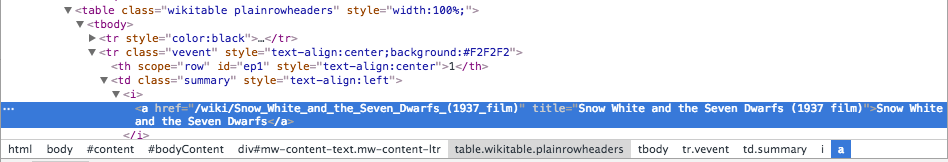
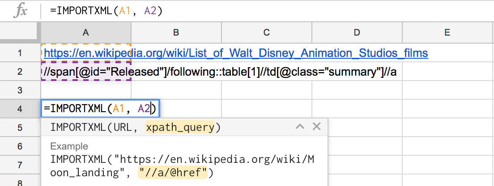
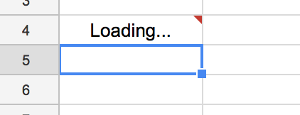
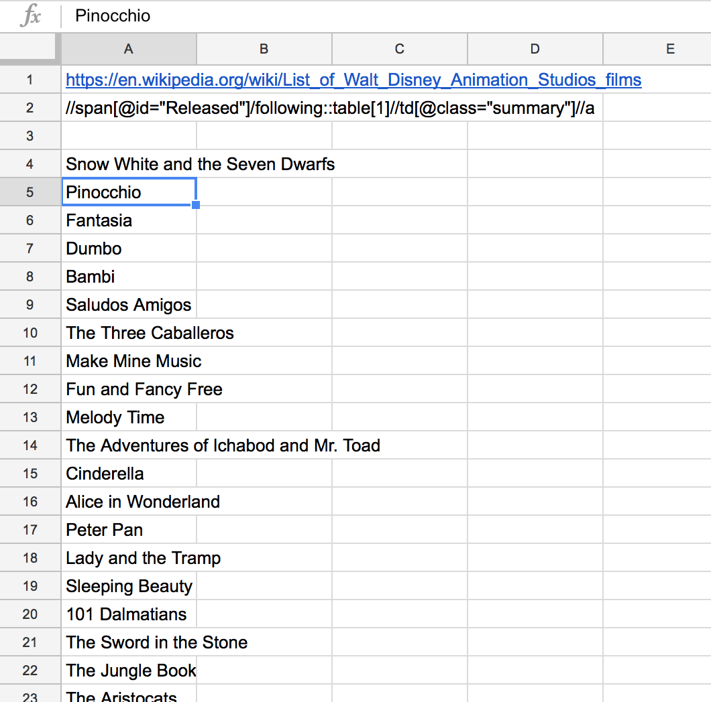
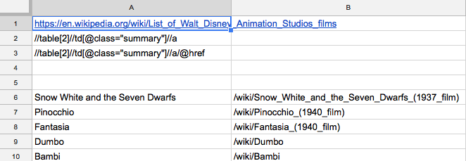
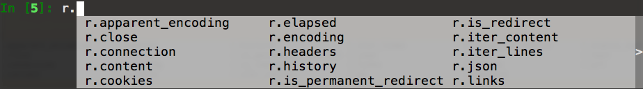

# Scraping with Xpath (and Google Sheets or Python)

##Prerequisites:

- Use *Google Chrome*
- Install the **XPather** extension in Google Chrome
- A Google account for using *Google Sheets*
- ipython (installed through `pip install ipython`)
- lxml (installed through `pip install lxml`)

## Step 1: Choose a page from which you want to scrape

Unfortunalely, Chrome will crash if you try this on a page with 5000+ links. So we need to find a simpler page to demonstrate this technique as example: https://en.wikipedia.org/wiki/List_of_Walt_Disney_Animation_Studios_films

More specifically we're looking for **all the titles of animated disney movies**, and their **links** to other wikipedia pages. Per each movie we're interested in:

- **the title**: for the obvious reasons that we use the title to identify the movie.
- **a wikipedia link**: so we can construct a url, which we can use to scrape further data next.

## Step 2: Inspect the element you want to scrape

Use the **Developer Tools Inspector** (cmd + alt + i) (from the View Menu, -> Developer -> Developer Tools).

The inspector lets you see the `HTML` code responsible for the page. It also lets you select HTML, and then highlight the corresponding element in the browser.  
Vice versa, it can also do the reverse: choose the selection tool: the top-left icon in the top row of the Developer Tools. (In the most recent version the icon looks like a pointer inside a box, in previous versions this was a magnifying glass). Then hover over any element in the browser and the corresponding code will light up. Click on an element in the browser and the corresponding code will be selected.

If we try that with the url above, we find **the anchors of the titles of all the movies** all have the following path:



## Step 3: Analyse which parts of the path to this element are unique and which are common for all elements you want to scrape

From the path bar (at the bottom of the above screenshot), you see that:

- this anchor tag `<a>` which we want to scrape
- is contained in an `<i>` tag,
- which is contained in a table data `<td>` tag with `class` *"summary"*,
- which is contained in a table row `<tr>` with `class` *"vevent"*,
- which is contained in a table `<table>` with `class`es *"wikitable"* and *"plainrowheaders"*,
- which is contained in a `<div>` with `id` *"mw-content-text"* and a `class` *"mw-content-ltr"*,
- which is contained in a `<div>` with `id` *"bodyContent"*,
- which is contained in a `<div>` with `id` *"content"*,
- which is contained in a `<body>` tag,
- which is contained in a `<html>` tag, the root of this document.

Parts of this information can be used to specifically select only the movie titles. It would be nice if we could define a search path for this page which would give us exactly all the movie titles, and nothing else.

Also note that there are 56 released movies. (Which we can conveniently see from the index number that wikipedia added.) So, if our filter results in 56 entries, that would be a good indication that we're doing it right.

## Step 4: Construct the Xpath

We can now try and create an Xpath to find only those elements, which we are interested in. By using Xpather in Chrome and playing around with different Xpaths, we can experiment with trial and error until we sharpen our Xpath to be exactly what we're looking for.

Some examples of Xpaths:

----

This Xpath will get all the table data elements (a *table data* element is the column **in** a table row):

`//td`

- the `//` tells that the `<td>` element could appear anywhere on the page
- *855 td's found*

----

And this one will get all the tables:

`//table`

*14 tables found*

----

And this Xpath selects an *anchor*, inside an *italic* tag, inside a *table data* tag, anywhere on the page

`//td/i/a`

*132 found*

----

If we want to get more specific, we can add some *specifiers*, like the path to only get `<td>` elements which have a `class`  called *"summary"*:
	
`//td[@class="summary"]`

*60 of those summary td's found ... still a bit too much: it also contains yet to be released titles*

----

This Xpath will get *only the first* table after the "Released" header:

`//span[@id="Released"]/following::table[1]`

- Notice that the `[@id=...]` is similar to the `[@class=...]` of the previous.
- The `/following::` part tells Xpath to only select elements which are preceded by the specified `span`.
- Finally we can limit these elements (tables in this case) by the `[n]` suffix, in which **n** is the index we're interested in.

*exactly 1 table, the first one*

----

Finally we can combine all this into one Xpath that will exactly gives us the titles and links we are interested in:

- Anywhere on the page, a span with a specific id ("Released")
- The first table after that span
- Inside that table, the "summary" table data
- And then the anchor (`<a>`) inside that table data

`//span[@id="Released"]/following::table[1]//td[@class="summary"]//a`

## Step 5: Usage of the Xpath in Google Sheets

The simplest way to use an XPath to extract data from a webpage would be through Google Sheets.

- Open a new **spreadsheet** document in Google Docs
- In cell `A1` insert the **url** of the page that we want to scrape
- In cell `A2` insert the **xpath** of the elements we want to extract
- In cell `A4` insert the following formula / macro:
	- `=IMPORTXML(url, xpath)`
- Press enter
- Wait .... and voila!



*Entering the XPath query*

----



*Waiting for results*

----



*The Results!*

----

Additionally, you can add `/@href` to the Xpath to also get the wikipedia links to the movies:



## Step 6: Usage of the Xpath in python

### lxml

You willl need the **lxml** module to use XPaths in python:

`pip install lxml`

### use ipython

Next, we'll be using ipython, to step by step, create the python code to download and scrape the movie titles and their links:

In `ipython`:

Import the etree component from lxml:

```python
from lxml import etree
```

Create a variable called `url`:

```python
url = "https://en.wikipedia.org/wiki/List_of_Walt_Disney_Animation_Studios_films"
```

Import the requests module:

```python
import requests
```

*Get* the url and put the results in a variable called r (after request)

```python
r = requests.get(url)
```

Let's use ipython to find out more about this *request* object r. Type `r` followed by a *tab* ⇥ 



So, as example, we can print the `headers`:

```python
r.headers
```

```python
{
	'Content-Length': '48496', 'Content-language': 'en', ... , 'Last-Modified': 'Mon, 20 Feb 2017 16:52:52 GMT',
 ... 'Content-Type': 'text/html; charset=UTF-8', ...
}
```

We see here that the charset of this page is `UTF-8`, which might be important information if we want to parse the page correctly.

Now get the html content of this page:

```python
html = r.text
```

And use this html to create a *tree* structure, containing the nodes and leaves of all the elements on this page.

```python
tree = etree.HTML(html)
```

Now we can use our XPath to filter to the elements and get only `a` tags which we are interested in, and put the result, a list, in a new variable:

```python
li = tree.xpath('//span[@id="Released"]/following::table[1]//td[@class="summary"]//a')
```

With this variable `li` as a list, look up its length:

```python
len(li)
```

And we can try to get one element from the list to further examine:

```python
elem = li[0]
```

The text of the element

```python
e.text
```

```python
'Snow White and the Seven Dwarfs'
```

The tag of the element

```python
e.tag
```

```python
'a'
```

And its attributes (or properties):

```python
e.attrib
```

```python
{'href': '/wiki/Snow_White_and_the_Seven_Dwarfs_(1937_film)', 'title': 'Snow White and the Seven Dwarfs (1937 film)'}
```

So if we want to get the link to the *subpage*, we get the `href` *key* from this `attrib` *dict*:

```python
elem.attrib['href']
```

```python
'/wiki/Snow_White_and_the_Seven_Dwarfs_(1937_film)'
```

### Compose this into a python script

```python
#!/usr/bin/env python

'''
This script will get all the titles and links from all the Disney movies,
and then use these links to further scrape data: the box-office revenues
'''

from lxml import etree
import requests

# The main url as starting point
url = "https://en.wikipedia.org/wiki/List_of_Walt_Disney_Animation_Studios_films"

# Get the request, html and make the tree
r = requests.get(url)
html = r.text
tree = etree.HTML(html)

# Use xpath to scrape a list of titles and links
li = tree.xpath('//span[@id="Released"]/following::table[1]//td[@class="summary"]//a')

# Loop over each title
for elem in li:
    link = "https://en.wikipedia.org" + elem.attrib['href']
    # Get the subpage and its tree
    req = requests.get(link)
    h = req.text
    t = etree.HTML(h)
    # Scrape the box office of this subpage
    box_office = t.xpath("//th[text()[contains(.,'Box office')]]/following::td[1]")
    # And print its text contents (only if there are actually box office numbers)
    if len(box_office) > 0:
        print box_office[0].text
```    

