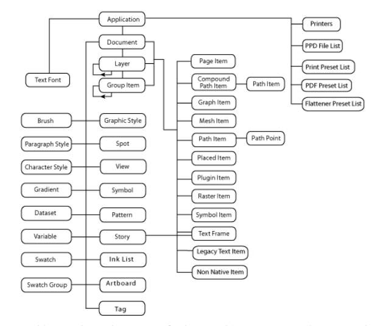
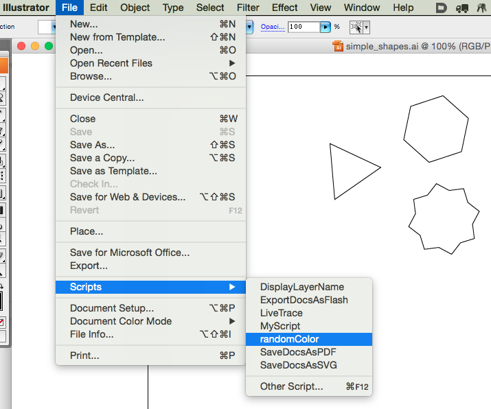
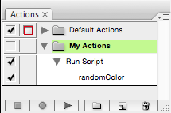

# Illustrator Scripting

With Illustrator Scripting you can create code-generated drawings, or you can write your own tools to streamline your workflow in Illustrator.

## Documentation

Adobe publishes two PDFs for documentation:

- The Adobe Illustrator **Scripting Guide**
- The Adobe Illustrator **Javascript Reference**

Go to the download page at [Illustrator Scripting Documentation - Adobe Developer Connection](http://www.adobe.com/devnet/illustrator/scripting.html) and get these two documents for your version of Illustrator.

- The **Scripting Guide** will explain you the basics of setting up your scripting toolchain, and will explain the DOM (Document-Object-Model) used by Illustrator
- The **Javascript Reference** contains a detailed list of all the functions and methods you can call on Illustrator and its objects. And it contains a lot of example code demonstrating how to use these functions.



## Apps to use

If you're writing your script and debugging it, you'll be running a few apps next to each other:

- ExtendScript Toolkit
- Illustrator (this is the target app)
- Your favorite text editor (e.g. Sublime text)
- Console (in Utilities)

## Language

- Javascript (not python)

While Adobe supports a few languages for scripting (AppleScript, VBScript and Javascript), it doesn't support Python unfortunately. We choose **Javascript** because because support by Adobe is better and it can be applied more universal.

## Using this

So how to go about using this?

As an example of a script, let's set all *Path Items* in a document to a random color. The code for this can be found in the **Reference** under "*Setting colors in a path*":

```javascript
// Sets the stroke and fill of a path item to colors of a randomly selected swatch

if ( app.documents.length > 0 && app.activeDocument.pathItems.length > 0 ) {
    doc = app.activeDocument;
    for (var i = 0; i < doc.pathItems.length; i++ ) {
        pathRef = doc.pathItems[i];
        pathRef.filled = true;
        pathRef.stroked = true;
        swatchIndex = Math.round( Math.random() * ( doc.swatches.length - 1 ) );
        pathRef.fillColor = doc.swatches[ swatchIndex ].color;
        pathRef.strokeColor = doc.swatches[ swatchIndex ].color;
    }
}
```

So how do we get this script running?

### 1. Where to install

You save this script in a `.jsx` file. Let's call it `randomColor.jsx` and then you save it in the `Scripts` folder in `Presets.localized` folder inside the Illustrator's applications folder.

Of course the exact path on your computer depends on:

- where you installed your Illustrator
- which version of Illustrator you have
- if you have a localized (translated) version of Illustrator or not

On my computer the folder is

`/Applications/Adobe Illustrator CS3/Presets.localized/Scripts.localized`

But on your machine it could very well be

`/Applications/Adobe Illustrator CC/Presets.localized/nl_NL/Scripts`

### 2. How to use

Then, once you placed the script there, you need to **restart Illustrator**, and you can find and execute the script from the **Menu**: **File** > **Scripts** > **randomColor**



### 3. How to automate

And, if you would like to speed up this last step, you can create an *Action* and assign a shortcut to it:

- From the **Actions** panel (Window menu > Actions)
- Create a New Action ... (from the menu of with the button)
    - Name the Action *Run Script*
    - Assign a Function key: e.g. F2 + Command
    - Click **Record**
- Click Stop
- **Insert Menu Item ...** (from the Action Panel menu)
    - type *rand*
    - Click **Find** (it will autocomplete it to "randomColor")
    - Click **Ok**


    
Now use the shortcut (cmd + F2) to run the script.

## Cases to use Illustrator Scripting over Plotdevice.io?

Why would you use Illustrator Scripting and not draw the stuff in python / Plotdevice? That's a good question. Most of the stuff you can do in Illustrator, you can also do in Plotdevice. So if you want to draw this stuff using code, often Plotdevice (or Processing for that matter), would be easier because you can stay in one application, and use a language you're familiar with.

However, there are some use cases in which Illustratot offers you functionality, you can not get from Plotdevice or Processing. I've identified a few of these use cases:

- Drawing stuff "by hand" using the *pen tool*
- Path functions like *Outline*
- Distort and Transform functions like *Twist* or *ZigZag*

----

# Example Scripts

I've put together three examples of Illustrator Scripts:

- one script that just works on **Illustrator itself**. It modifies an existing Illustrator drawing: [Scripting Tutorial to ExpandedOutlines](https://github.com/ArtezGDA/illustratorPlugin-Examples/blob/master/Tutorial_Scripting_ExpandedOutlines.md)
- one script that **exports an SVG file**.
- one script that **imports a JSON file** and uses its data to modify a drawing.

