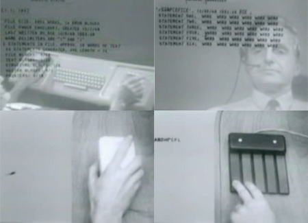
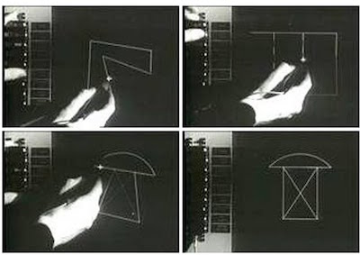

#####Department: Graphic Design

- Course: **Media Design**
- Year: 2016-2017, 2nd year
- Teacher: Dirk van Oosterbosch
- Semester: 1

###Assignment #1:
#Pioneers

##Learning Goals

Learn the basic skills of programming in python. Develop a method of documenting your coding efforts and sketches. Gain insights in the history of human-computer interaction and the people and ideas involved in this research. Develop a vision on structuring and organizing information in the digital age. Being able to produce sketches and a prototype for an information system and structure.

##Description

This assignment consists out of two parts: a **coding** part and a **systems design** part.

#### Coding

The coding part will be covering basic concepts of programming in *python*. Hopefully this is partly a refreshing-your-memory kind of course, as we will be touching the basic coding concepts that you're probably still familar with from processing: `for`-loops, `if`-statements, `variables`. The language of coding will be different: *python* instead of *java* (Processing), but conceptually that change isn't dramatic, and might even help understanding these concepts better.

Each week there will be some explanation and examples of these coding concept. And each week there will be some coding homework allowing you to apply the concepts yourself and experiment with the code.
 
We will discuss the following coding constructs:

- `for` loops
- variables
- `if` statements
- GitHub
- Types: `int` / `bool` / `float` / `string`
- Arrays,

and one collaboration tool:

- GitHub.com

#### Systems Design

Design (the system and structure for) a **catalogue** of the inventions of *Human-Computer Interaction* pioneers.

Human-Computer Interaction (HCI) is the study of the interaction the interface and the interface between us, humans, and computers that allows us to give instructions to the computer and allows the computer to gives us feedback about the process and the outcome. It deals with both **hardware inventions** (e.g. the mouse or novel 3D pen), **software inventions** (e.g. the trick that allows you to switch between applications, or copy and paste) and **visual and metaphores inventions** (e.g. the idea of windows, the idea of folders that store information.)

From the early 1960s onward, computers became powerful enough to require and allow for systems to aid the human in using them. Most of the computer concepts and peripherals that we are still using today were invented in this era, 1960s and early 1970s; the computer mouse, draggable windows, folders, etcera. This assignment is party a **study of the pioneers of that era**, who brought us these inventions.

The design assigment itself is **to design** the structure and system of **a catalogue** to collect and record the work of these pioneers.

Because much of the work of these pioneers also tries to solve the problems of smarter information storage and retrieval, your catalogue should try to do the same: find a novel way to collect and organize the information about these pioneers, their work, ideas and inventions. So that knowlegde is augmented, insights can be gained, and historic ideas can be combined into new ones. Hence, the design of this catalogue *should focus on the structure of the information and the systems to store and retrieve it*, rather than only on the visual appearance of this catalogue.

Your design should consist of **sketches**, **diagrams** and **models** of these structures and systems; **a prototype** of the complete catalogue (demonstrating its use case); and a few **detailed cards** / pages / entries, as an example of the visual result.

The following human-computer interaction pioneers will be studied:

-  Vannevar Bush
- Ivan Sutherland
- Douglas Engelbart
- Alan Kay
- Theodore Nelson
- Bret Victor

##Planning

#####Week 1:
*August 30th 2016*

**Lesson 0: Introduction**

- Introduction to the Media Design course.
- Introduction to the assignment.

**Homework:**

- Create an account on GitHub, let me and your class know your account handle and accept the invitation to the shared repository.
- Download and install the [software](Software.md)
- Create a journal, notebook or blog about your research.
 	- Document your programming efforts, ideas and sketches
- Read *As we may think* –  Vannevar Bush (see literature below)

#####Week 2:
*September 6th 2016*

- [Lesson 1](Basics/Lesson_01_ForLoops/README.md): `for` loops 
- Sketchpad – by Ivan Sutherland

**Homework:**

- Make notes about the concepts and work of  Vannevar Bush and Ivan Sutherland
- Make sketches of a system to collect and organize these notes and concepts
- Code: [Homework Lesson 01](Basics/Lesson_01_ForLoops/Lesson_01_For_Homework.md)

#####Week 3:
*September 13th 2016*

- Homework check:
	- Complete your **GitHub** profile: avatar + name, join ArtezGDA organisation, make sure your member of 'Students'
	- for loops
- "Mother of all **Demo**'s" - NLS (oNLineSystem) – by Douglas Engelbart
- coding: - [Lesson 2](Basics/Lesson_02_Variables/README.md)
	- while loop
	- variables

**Homework:**

- Watch the complete Douglas Engelbart Demo and make notes about the concepts and all inventions presented
- Make more sketches of the system of organizing, based on Engelbart's concepts for augmenting human intellect.
- Code:
	- Read the course lesson about [Data Types and Variables](http://www.python-course.eu/variables.php)
	- Follow the [while loop lesson](https://learnpythonthehardway.org/book/ex33.html) from Learn Python the hard way
	- [Homework Lesson 02](Basics/Lesson_02_Variables/Lesson_02_Variables_Homework.md)
- GitHub!

#####Week 4:
*September 20th 2016*

- Homework check:
	- github
	- code
- `if` statements: [Lesson 3](Basics/Lesson_03_If_statements/README.md)
- Dynabook – by Alan Kay
- Sketches and Protoyping

**Homework:**

- Read both Git for designer tutorials (see literature)
- complete your GitHub account and accept!!
- Watch _The computer revolution hasn't happen yet_ talk by **Alan Kay**
- Code: [Homework Lesson 03](Basics/Lesson_03_If_statements/Lesson_03_If_Homework.md)

#####Week 5:
*September 27th 2016*

- Homework recap
- git & GitHub: [Lesson 4](Basics/Lesson_04_Git/README.md) (Tips)
- Introduction Theodore Nelson

**Homework:**

- Code and Exercise: [Homework Lesson 04](Basics/Lesson_04_Git/Lesson_04_Git_Homework.md) 
- Watch _ZigZag demo_ – by **Theodore Nelson**
- Watch the 2001 version of **Alan Kay**'s _The computer revolution hasn't happen yet_

#####Week 6:
*October 4th 2016*

- GitHub Homework recap
- Types: [Lesson 5](Basics/Lesson_05_Types/README.md) – `int` / `bool` / `float` / `string`
- Introduction Bret Victor
- Examples of prototypes:
	- video prototype (example: ["wirehooks": interface for making and breaking connections](https://vimeo.com/8337497))
	- paper prototype? 
- Group talks pioneers 

**Homework:**

- Homework recap
- Code: [Homework Lesson 05](Basics/Lesson_05_Types/Lesson_05_Types_Homework.md)
- Watch _The future of programming_ – by **Bret Victor**
- Design the prototype for your Catalogue (2 weeks)

#####Week 7:
*October 11th 2016*

- [Lesson 6](Basics/Lesson_06_Collections/README.md): Collections: Arrays & Dictionaries
- Bret Victor: inventing by principle
- Recap & Questions

**Homework:**

- Code: [Homework Lesson 06](Basics/Lesson_06_Collections/Lesson_06_Collections_Homework.md)
- Watch _Inventing on Principle_ – by **Bret Victor**
- Finish the prototype for your Catalogue

#####Week 8:
*October 18th 2016*

- Evaluation

##Evaluation

Criteria for judging the work:

- Acquired **coding skills**
- the **creative process**,
- **insights** from the history of HCI,
- **demonstration** of understanding and **presentation** of designs for **structures** and **systems** 
- the process and **workflow** of creating ideas, sketches and a prototype.

##Literature

####Reading

- [Vannevar Bush - As we may think](reading/Vannevar_Bush-As_We_May_Think.pdf)
- Manuel Lima - The Book of Trees: Visualizing Branches of Knowledge (the Artez library has a copy)

####Video's

- [A Computer Glossary - Charles and Ray Eames](http://www.eamesoffice.com/the-work/a-computer-glossary-2/)
- SketchPad Demo - Ivan Sutherland:
	- [Original 1963 video](https://www.youtube.com/watch?v=57wj8diYpgY)
	- [Sketchpad: A man-machine graphical communication system (Thesis)](https://www.cl.cam.ac.uk/techreports/UCAM-CL-TR-574.pdf)
	- [Sketchpad: MIT video, part 1](https://www.youtube.com/watch?v=USyoT_Ha_bA)
	- [Sketchpad: MIT video, part 2](https://www.youtube.com/watch?v=BKM3CmRqK2o)
- [1968 Demo of NLS (oNLineSystem) - Douglas Engelbart](https://vimeo.com/32381658)
- [The Computer Revolution Hasn't Happen Yet](https://vimeo.com/14965237) - Alan Kay (lecture at the Polytechnic University 2001)
- [ZigZag](https://www.youtube.com/watch?v=WEj9vqVvHPc) - Theodore Nelson. For more Ted Nelson:
	 - [https://www.youtube.com/watch?v=lNAPEPqQjJo](Rethink & Arise!) (lecture)
	 - [https://www.youtube.com/watch?v=KdnGPQaICjk](Computers for Cynics) Youtube series: [#0](https://www.youtube.com/watch?v=KdnGPQaICjk), [#1](https://www.youtube.com/watch?v=Qfai5reVrck), [#2](https://www.youtube.com/watch?v=c6SUOeAqOjU), [#3](https://www.youtube.com/watch?v=bhzD2FKEEds), [#4](https://www.youtube.com/watch?v=_xL19f48m9U), [#5](https://www.youtube.com/watch?v=_9PmIkAYhI0), [#6](https://www.youtube.com/watch?v=gWDPhEvKuRY), [#7](https://www.youtube.com/watch?v=3CMucDjJQ4E), [#n](https://www.youtube.com/watch?v=w950GgRzbJk)
- [The future of programming](https://vimeo.com/71278954) - Bret Victor
- Inventing on Principle - Bret Victor

####Inspiration

- [**Hello World!**](http://hello-world.cc/?page_id=16) (Documentary 2013) ([Watch on Vimeo](https://vimeo.com/60735314))
- [Film Dialogue from 2,000 screenplays, Broken Down by Gender and Age](http://polygraph.cool/films/)

####Coding

- [PlotDevice Tutorial](http://plotdevice.io/tut/)

####Git

- Treehouse's [Git for Designers](http://blog.teamtreehouse.com/git-for-designers-part-1) article
- Tutsplus' [Git for Designers](http://code.tutsplus.com/tutorials/git-for-designers--pre-54689) tutorial
