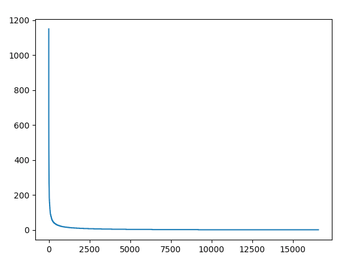
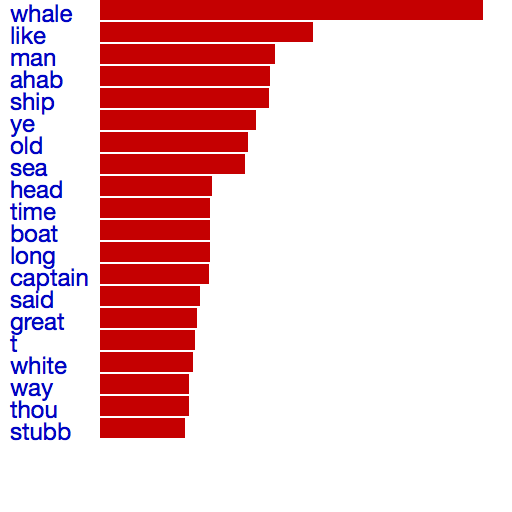

# Visualizing the Word Frequencies Count

We got the data from [Counting Word Frequencies](../../../Advanced/count_word_frequency/README.md)

## Method 1: matplotlib

### First attempt: in `ipython` load the data and get some insights in the scale

```python
import json
import matplotlib.pyplot as plt

with open('word_frequencies.json') as infile:
    freqData = json.load(infile)
len(freqData)
freqData[0]
```

> `16573`
> `{u'freq': 1150, u'word': u'whale'}`

```python
# Use "list comprehension to create a new list from an old list
listOfNumbers = [w['freq'] for w in freqData]
# plot
plt.plot(listOfNumbers)
plt.show()
# flip diagram in histogram
plt.hist(listOfNumbers)
plt.show()
```



## Method 2: plotdevice

Instead of using `ipython` and `matplotlib`, we can also use plotdevice to draw a graph. And plotdevice allows us to have much more control over the design, with e.g. colors and fonts, than matplotlib will ever have.

Create an new plotdevice file in the same directory as your `json` file.

Import the data in the same way in plotdevice.

```python
import json

with open('word_frequencies.json') as infile:
    freqData = json.load(infile)
print len(freqData)
print freqData[0]
```

Then draw the graph ourselves.

Because 16573 words is a bit much, let's just focus on the top 20. (Taking benefit of the fact that we already sorted the frequency list by frequency before.)

```python
# Start drawing at the top (y = 0)
y = 0
# Only limit on the first 20
for word in freqData[:20]:
		# draw each line 22 pixels lower
    y = y + 22
    # calculate the width of the bar sensibly (1150 / 3 for the widest bar)
    barwidth = word['freq'] / 3
		# draw each frequency as a bar graph
    rect(100, y - 22, barwidth, 20)
```

Actually we can now also add the words themselves as index

```python
    text(word['word'], 10, y)
```

And finally add some colors with

```python
		# blue
		fill(0, 0, 0.8)
		# red
		fill(0.8, 0, 0)
```

